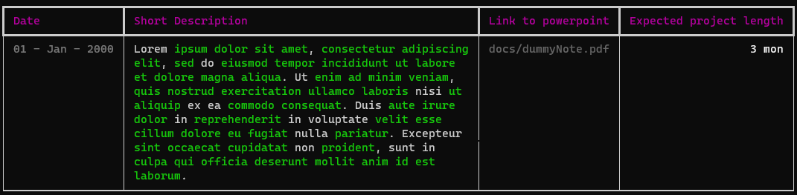

# Notes Logger App

The Notes Logger App is a Python application for logging and organizing your notes. It utilizes KeyBERT to identify the most important words in your notes, which are then highlighted using rich text formatting.



### Features

* Add new notes and assign them a category for easy organization
* Automatically identify and highlight important words in your notes using KeyBERT
* View all of your notes in a color-coded, easy-to-read table

### Installation 

1. Clone the repository:

```bash
git clone https://github.com/AndreasKaratzas/notes-logger.git
```

2. Create a conda virtual environment and install the required Python packages:
```bash
conda env create --file environment.yml
conda activate notes-logger
```
3. To use `manim`, follow these [instructions](https://docs.manim.community/en/stable/installation.html) with respect to your OS.

### Usage

First, create your new note under the `data/notes` directory. You can use any name you want, but you have to preserve the `.json` format demonstrated in the `dummyNote.json` sample file:
    
```json
{
    "Date": "<day>-<month>-<year>",
    "Short Description": "Short description of the note",
    "Link to powerpoint": "Link to some presentation in case you have one",
    "Expected project length": "<x> mon + <y> days"
}
```

Then, start the application and compile your notes into a table by running:
```bash
python main.py
```

There are additional arguments you can use. Type `python main.py --help` to see them.

### Todo

- [ ] Fix the issue with whitespace before ')' and ']' and '}' and '>' and ending '`'.
- [ ] Fix the issue with whitespace removal between some words.

### Credits
The Notes Logger App was developed by Andreas Karatzas. It utilizes the following Python packages:

* KeyBERT
* Rich

### License

This application is released under the GNU Affero General Public License v3.0. See the `LICENSE` file for more information.

### Contributing

1. Fork the repository.
2. Make your changes and commit them.
3. Submit a pull request.
4. Please make sure to follow the project's code of conduct.

### Contact

If you have any questions or concerns, please contact me at [andreas.karatzas@protonmail.com](mailto:andreas.karatzas@protonmail.com).
